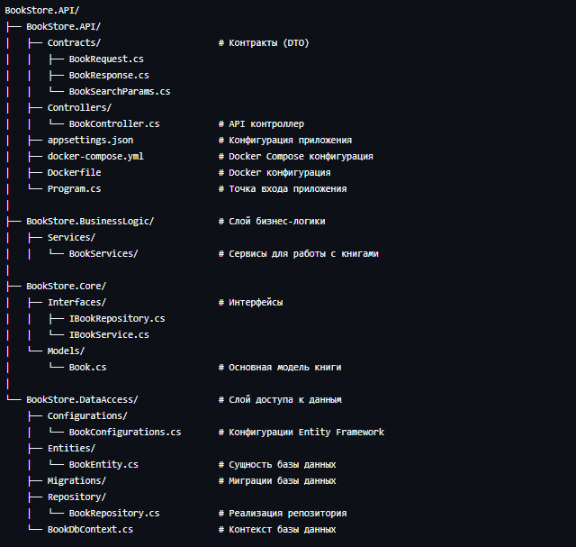
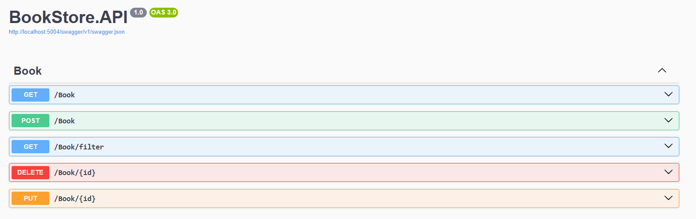

# BookStore.API
Проект представляет собой бэкенд-часть "книжного магазина", для хранения и управления записей о прочитанных книгах, обеспечивающая набор операций CRUD и сортировку книг по различным параметрам.

## Структура 

    
## Использование

API Endpoints
- GET /Book - Получить все книги

- POST /Book - Создать книгу

- PUT /Book/{id} - Обновить книгу

- DELETE /Book/{id} - Удалить книгу

- GET /Book/filter - Фильтрация и сортировка

  

Этот API предназначен для работы с фронтенд-приложением: https://github.com/NikitosII/bookstore.git
